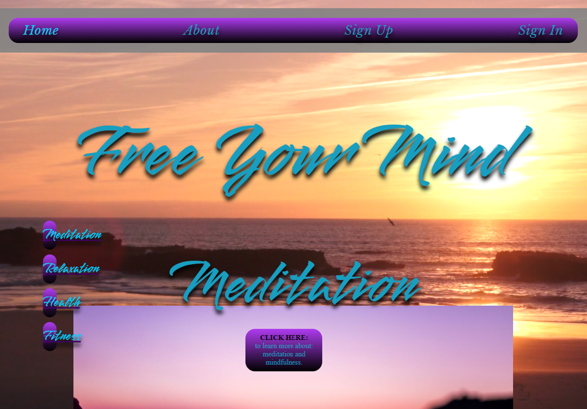

# FREE YOUR MIND
https://spur-tech.github.io/Free-Your-Mind/

## Welcome Reader,

This is a description of this website and all I'ts workings.

## Project target:
---
FREE YOUR MIND is a website where you can learn about meditation and watch guided meditation videos, learn about the importance of relaxation, eating healthy and fitness. You can also create an account so you can save all your favorite meditation videos, your relaxation schedule, healthy recipes and your exercise schedule.

## User stories:
---
As a first time user I would like a site that is easy on the eye and easy to use.

As a first time user I would like to learn about meditation.

As a first time user I would like to learn about what foods are good for me.

As a returning user I like to watch guided meditation videos and save my favorite ones.

As a returning user I would like to store all my healthy food recipes in one place.

As a returning user I would like to access all my saved recipes, meditation videos, exercise and relaxation schedules and edit them when i choose.

## Wireframes:
---
The wire frames for the pages.

- [Landing Page](assets/images/wireframe-landing-page.png)

- [About Page](assets/images/wireframe-about-page.png)
- [Sign up and Sign in Pages](assets/images/wireframe-signing-pages.png)
- [Thank you and welcome Pages](assets/images/wireframe-thankyou-and-welcome-page.png)
- [Meditation page](assets/images/wireframe-meditation-page.png)
- [Relaxation page](assets/images/wireframe-relaxation-page.png)
- [Healthy food page](assets/images/wireframe-health-page.png)
- [Fitness page](assets/images/wireframe-fitness-page.png)
- [Account page](assets/images/wireframe-account-page.png)

----

##  Screen shots of the site and it's responsive abilities:

I used http://ami.responsivedesign.is/ to check what it would look like on all devices.
As you can see it's fully responsive right across all devices and adapts to any screen size.

# Organization:

All files are appropriately named with no capitalization or spaces and all in corresponding folders.
Each page has its own css and javascript for ease of maintenance.

- Assets
- css
- style.css
- about .css
- account.css
- animation.css
- meditation.css
- relaxation.css
- health.css
- fitness.css
- thankyou.css
- welcome-back.css
- images
- js
- index.js
- meditation.js
- relaxation.js
- health.js
- fitness.js
- signup.js
- idex.html
- meditation.html
- relaxation.html
- health.html
- fitness.html
- about.html
- signup.html
- signin.html
- thankyou.html
- welcome-back.html
- README.md

## features:
---
All fonts were used from https://fonts.google.com/ and they were Libre Baskerville and smooch

1. The NAVBAR has a soft grey background with a gradient purple to black on top with an eye catching light blue font. Linking to Home page, About page, Sign up page and sign in page.
2. When hovered over the font brightens.
3. The active property brightens the font depending on what page is selected.
4. The NAVBAR is responsive to all screen sizes.
5. The NAVBAR is seen on all pages for ease of use.

# The landing page:
---

1. The home page has a calming video background of a sunset beach.
2. It has a quick scroll menu that follows where you are on the page for ease of us.
3. There is an image and click to learn more on each subject which takes you to the next page and eases in gently for a calming UX.
4. All elements on the page are responsive to all screen sizes.

# The footer:
---

1. The footer contains identical links as NAVBAR for maximize UI, UX control.
2. My copyright tag is shown at th bottom.
3. All filly responsive.

## About Page:
---

## format changes due to screen size.

1. The background is a gentle purple gradient which matches NAVBAR.
2. Font colour also match NAVBAR font.
3. the soft grey sets off the purple and highlights content.
4. The image of thinking man is responsive to all screen sizes as is all elements of the page.
5. The paragraph font matches the purple background adn has popping red titles.

## Sign up Page:
----

## format changes due to screen size.

1. continued colour flow,  navbar  and footer throughout all pages.
2. signing area has shadowing for a 3D effect.
3. I've added javascript validation with changing messages to all input areas.

5. Sign up page links to thank you page before account page.

## Sign in Page:
----

## format changes due to screen size.

1. continued colour flow,  navbar  and footer throughout all pages.
2. signing area has shadowing for a 3D effect to match sign up page.
3. I've added required field to sign in to show the difference to javascript messaging.

4. Sign in page links to welcome back page before account page.

## Account Page:
----

## format changes due to screen size.

1. continued colour flow,  navbar  and footer throughout all pages.
2. A sample guided meditation video.
3. A small library of other meditation videos.
4. A save your favorite video section.
5. A save your diet schedule section.
6. A save your healthy recipes section.
7. A save your exercise schedule section.
8. A logout button to take you back to the home page.

## Meditation Page:
----

## format changes due to screen size.

1. continued colour flow,  navbar  and footer throughout all pages.
2. Each page has five different pointers at the bottom.

## Relaxation Page:
----

## format changes due to screen size.

1. continued colour flow,  navbar  and footer throughout all pages.
2. Each page has five different pointers at the bottom.

## Healthy food Page:
----

## format changes due to screen size.

1. continued colour flow,  navbar  and footer throughout all pages.
2. Each page has five different pointers at the bottom.

## Fitness Page:
----

## format changes due to screen size.

1. continued colour flow,  navbar  and footer throughout all pages.
2. Each page has five different pointers at the bottom.

# Testing:

- First line of testing was to make sure links to each page worked in the NAVBAR, footer and quick links button links to other pages.

- Then tested responsive effects on my phone, Ipad, laptop and pc all worked efficiently.

 
 

- I also tested for accessibility on https://wave.webaim.org/  and lighthouse 
 
 

- My testing for my css was performed on https://jigsaw.w3.org/css-validator/validator

- My testing for my html was performed on https://validator.w3.org/ 

- I tested Java script on https://esprima.org/demo/validate.html

- I then put my site up on Slack for scrutiny and received a lot of compliments.

- spell check README.md on https://www.online-spellcheck.com/

# Bugs and Fixes:

- I had many issues with various areas as the site is so big. the first was the video background aligning and playing and staying behind all other elements so I did top and left 50% then transform translate 50%, 50% and that seemed to work.

- I had issues with image sizing and centering which I dealt with in media queries.

- I had issues with contrast so I adjusted accordingly.

- I had issues with aria labels and adjusted accordingly.

- I had issues with javascript as normal but pressed on and achieved what was necessary.

- I had issues with creating a box to save your favorite items in then thought, This just a demo site and the idea is all thats needed for that to make an account page look like an account page.

- I had issues with click buttons on front page as they had a button with a paragraph in so I turned it into an a tag.

- I had issues with quick scroll to th right place on the page so I created an invisible div, positioned it absolute but a new error was it needed a title so I changed it to a span.

# Credits:

I would like to say thank you to everyone on Slack and especially Dave Horrocks for taking time to sit through some of the page linking faults I had and get me back on my feet.

A big thank you to my mentor Jack for explaining form validations in Java script and taking a call to screen share with me.

I would like to credit youtube for the hours each night and day watching random videos on techniques and strategies on different aspects of web development. also I downloaded the meditation videos from there.

Thank you to stack overflow for email regular expressions as I put in the code.

Thank you to code institute for the readme.md template.

Thank you to Google fonts .

Thank you to font awesome.

Thank you to Balsamiq wireframes.

Thank you to ami responsive and lighthouse.

## A credit to the following:

https://validator.w3.org/

https://jigsaw.w3.org/css-validator/

https://esprima.org/demo/validate.html

https://wave.webaim.org/

https://fonts.google.com/

https://fontawesome.com/v5.15/icons?d=gallery&p=2&m=free

https://www.youtube.com/

https://github.com/Code-Institute-Solutions/readme-template

https://balsamiq.com/?gclid=Cj0KCQiA-qGNBhD3ARIsAO_o7ylOuN35WvS_a9h5lct3MRm73f2QkWIiy-HHSgxwuLB5U5yQZlcm8kwaAp6IEALw_wcB

http://ami.responsivedesign.is/

# Deployment:

This site was developed in Gitpod, committed and pushed to Github, and deployed on GitHub Pages.

## How to deploy this site:

- Log in to Github then go to the repository you would like to deploy.
- Click on Settings in the toolbar.
- Click on Pages.
- Click on the Branch in the dropdown menu, and select Main.
- Click on Save.
- Click on the URL to navigate to the live site.

 

