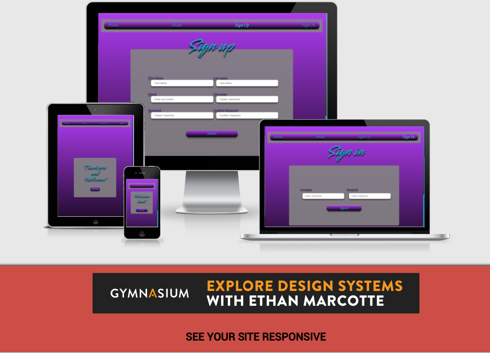
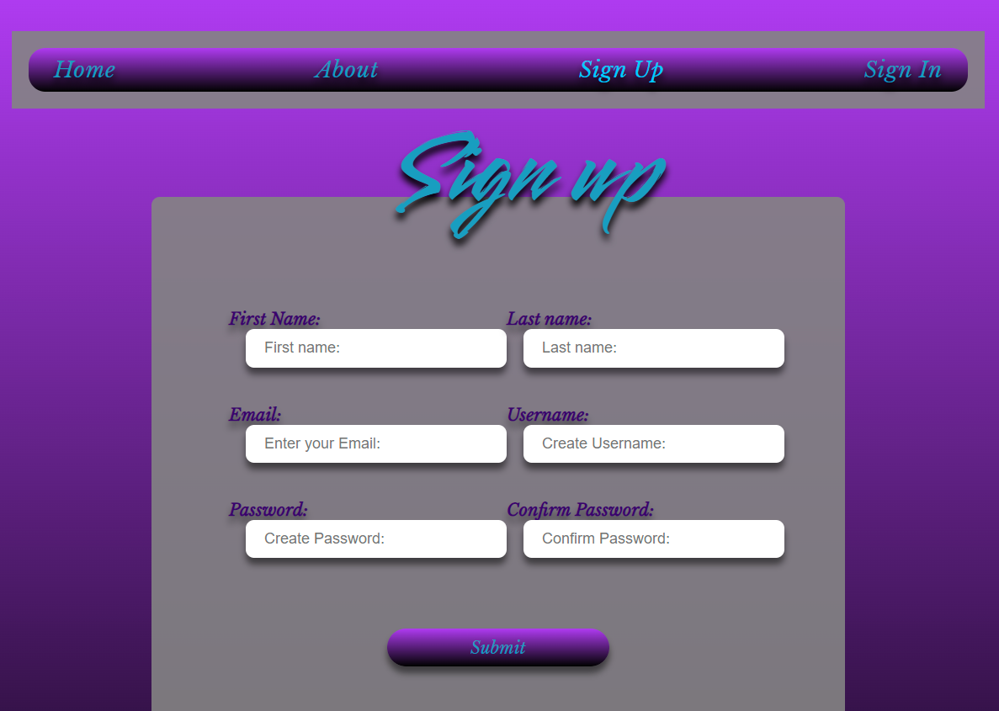

# FREE YOUR MIND
https://spur-tech.github.io/Free-Your-Mind/

## Welcome Reader,

This is a description of this website and all I'ts workings.

## Project target:
---
FREE YOUR MIND is a website where you can learn about meditation and watch guided meditation videos, learn about the importance of relaxation, eating healthy and fitness. You can also create an account so you can save all your favorite meditation videos, your relaxation schedule, healthy recipes and your exercise schedule.

## User stories:
---
As a first time user I would like a site that is easy on the eye and easy to use.

As a first time user I would like to learn about meditation.

As a first time user I would like to learn about what foods are good for me.

As a returning user I like to watch guided meditation videos and save my favorite ones.

As a returning user I would like to store all my healthy food recipes in one place.

As a returning user I would like to access all my saved recipes, meditation videos, exercise and relaxation schedules and edit them when i choose.

## Wireframes:
---
The wire frames for the pages.

- [Landing Page](assets/images/wireframe-landing-page.png)

- [About Page](assets/images/wireframe-about-page.png)
- [Sign up and Sign in Pages](assets/images/wireframe-signing-pages.png)
- [Thank you and welcome Pages](assets/images/wireframe-thankyou-and-welcome-page.png)
- [Meditation page](assets/images/wireframe-meditation-page.png)
- [Relaxation page](assets/images/wireframe-relaxation-page.png)
- [Healthy food page](assets/images/wireframe-health-page.png)
- [Fitness page](assets/images/wireframe-fitness-page.png)
- [Account page](assets/images/wireframe-account-page.png)

----

##  Screen shots of the site and it's responsive abilities:

I used http://ami.responsivedesign.is/ to check what it would look like on all devices.
As you can see it's fully responsive right across all devices and adapts to any screen size.

# Organization:

All files are appropriately named with no capitalization or spaces and all in corresponding folders.
Each page has its own css and javascript for ease of maintenance.

- Assets
- css
- style.css
- about .css
- account.css
- animation.css
- meditation.css
- relaxation.css
- health.css
- fitness.css
- thankyou.css
- welcome-back.css
- images
- js
- index.js
- meditation.js
- relaxation.js
- health.js
- fitness.js
- signup.js
- idex.html
- meditation.html
- relaxation.html
- health.html
- fitness.html
- about.html
- signup.html
- signin.html
- thankyou.html
- welcome-back.html
- README.md

## features:
---
All fonts were used from https://fonts.google.com/ and they were Libre Baskerville and smooch

1. The NAVBAR has a soft grey background with a gradient purple to black on top with an eye catching light blue font. Linking to Home page, About page, Sign up page and sign in page.
2. When hovered over the font brightens.
3. The active property brightens the font depending on what page is selected.
4. The NAVBAR is responsive to all screen sizes.
5. The NAVBAR is seen on all pages for ease of use.

# The landing page:
---

1. The home page has a calming video background of a sunset beach.
2. It has a quick scroll menu that follows where you are on the page for ease of us.
3. There is an image and click to learn more on each subject which takes you to the next page and eases in gently for a calming UX.
4. All elements on the page are responsive to all screen sizes.

# The footer:
---

1. The footer contains identical links as NAVBAR for maximize UI, UX control.
2. My copyright tag is shown at th bottom.
3. All filly responsive.

## About Page:
---

## format changes due to screen size.

1. The background is a gentle purple gradient which matches NAVBAR.
2. Font colour also match NAVBAR font.
3. the soft grey sets off the purple and highlights content.
4. The image of thinking man is responsive to all screen sizes as is all elements of the page.
5. The paragraph font matches the purple background adn has popping red titles.

## Sign up Page:
----

## format changes due to screen size.

1. continued colour flow,  navbar  and footer throughout all pages.
2. signing area has shadowing for a 3D effect.
3. I've added javascript validation with changing messages to all input areas.

5. Sign up page links to thank you page before account page.

## Sign in Page:
----

## format changes due to screen size.

1. continued colour flow,  navbar  and footer throughout all pages.
2. signing area has shadowing for a 3D effect to match sign up page.
3. I've added required field to sign in to show the difference to javascript messaging.

4. Sign in page links to welcome back page before account page.

 

